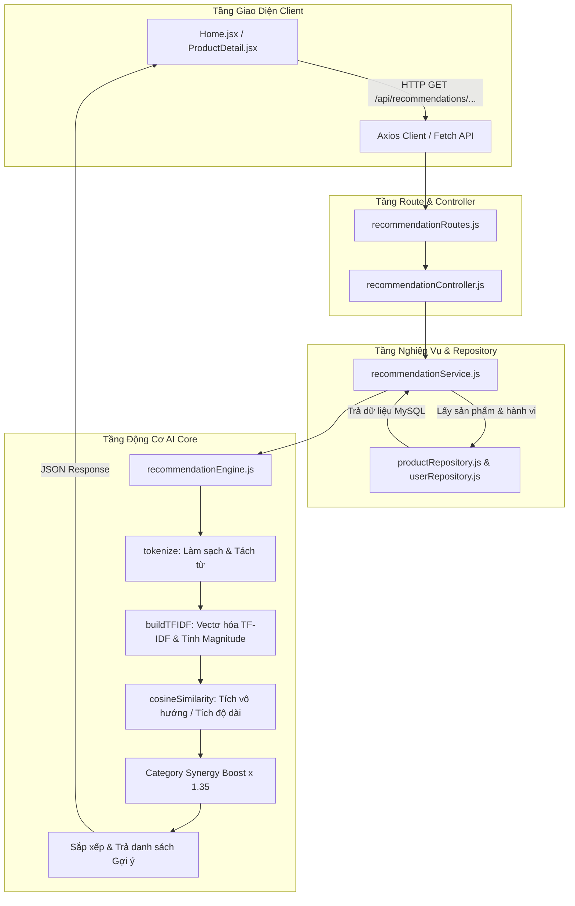

# GIẢI THÍCH MÃ NGUỒN CHI TIẾT LUỒNG GỢI Ý SẢN PHẨM AI (RECOMMENDATION ENGINE CODEWALKTHROUGH)

Tài liệu này giải thích chi tiết từng dòng mã nguồn, sơ đồ luồng dữ liệu, thuật toán toán học LaTeX và cách kết nối giữa các tầng **Frontend (React)** $\rightarrow$ **Backend (Controllers/Services)** $\rightarrow$ **AI Core Engine (TF-IDF & Cosine Similarity)** $\rightarrow$ **Database (Repositories)**.

---

## 📌 MỤC LỤC
1. [SƠ ĐỒ DÒNG CHẢY MÃ NGUỒN (CODE FLOW DIAGRAM)](#1-sơ-đồ-dòng-chảy-mã-nguồn)
2. [GIẢI THÍCH CHI TIẾT ĐỘNG CƠ AI (recommendationEngine.js)](#2-giải-thích-chi-tiết-động-cơ-ai)
   - 2.1. Tiền xử lý văn bản & Lọc từ dừng (`tokenize`)
   - 2.2. Vectơ hóa đặc trưng TF-IDF & Công thức toán học (`buildTFIDF`)
   - 2.3. Thuật toán Cosine Similarity & Công thức toán học (`cosineSimilarity`)
   - 2.4. Gợi ý sản phẩm tương tự & Công thức tính điểm (`getSimilarProducts`)
   - 2.5. Gợi ý sản phẩm cá nhân hóa & Công thức User Vector (`getPersonalizedRecommendations`)
3. [GIẢI THÍCH TẦNG SERVICE VÀ CONTROLLER](#3-giải-thích-tầng-service-và-controller)
   - 3.1. Ghi vết tương tác & Trọng số hành vi (`recommendationService.js`)
   - 3.2. Điều hướng Request API (`recommendationController.js`)
4. [GIẢI THÍCH TẦNG GIAO DIỆN REACT](#4-giải-thích-tầng-giao-diện-react)
   - 4.1. Lấy dữ liệu gợi ý trên Trang chủ (`Home.jsx`)
   - 4.2. Tìm kiếm Live Auto-complete (`Header.jsx`)
5. [BẢNG TỔNG KẾT VÀ HỆ THỐNG CÔNG THỨC TOÁN HỌC](#5-bảng-tổng-kết-và-hệ-thống-công-thức-toán-học)

---

## 1. SƠ ĐỒ DÒNG CHẢY MÃ NGUỒN (CODE FLOW DIAGRAM)



---

## 2. GIẢI THÍCH CHI TIẾT ĐỘNG CƠ AI (`backend/utils/recommendationEngine.js`)

### 2.1. Tiền xử lý văn bản & Lọc từ dừng (`tokenize`)

```javascript
// Dòng 6-10: Khai báo Tập hợp từ dừng (Stop Words) không mang giá trị phân loại
const STOP_WORDS = new Set([
  'và', 'của', 'cho', 'có', 'là', 'các', 'nhưng', 'được', 'bằng', 'với', 'trong',
  'ngoại', 'nhà', 'phù', 'hợp', 'chất', 'liệu', 'kiểu', 'dáng', 'phong', 'cách',
  'the', 'and', 'a', 'of', 'to', 'in', 'is', 'for', 'with', 'on', 'at', 'by'
]);

/**
 * Dòng 17-24: Tách từ & làm sạch văn bản
 */
function tokenize(text) {
  if (!text) return [];
  return text
    .toLowerCase() // 1. Chuyển thành chữ thường
    .replace(/[^\w\sàáạảãâầấậẩẫăằắặẳẵèéẹẻẽêềếệểễìíịỉĩòóọỏõôồốộổỗơờớợởỡùúụủũưừứựửữỳýỵỷỹđ]/g, ' ') // 2. Giữ ký tự tiếng Việt & xóa ký tự đặc biệt
    .split(/\s+/)  // 3. Tách chuỗi theo khoảng trắng
    .filter(word => word.length > 1 && !STOP_WORDS.has(word)); // 4. Lọc từ quá ngắn hoặc là từ dừng
}
```
- **Ý nghĩa code**: Biến văn bản mô tả sản phẩm thô (VD: *"Áo khoác phong cách thời trang cao cấp với chất liệu tốt"*) thành tập hợp token chuẩn: `['áo', 'khoác', 'thời', 'trang', 'cao', 'cấp']`.

---

### 2.2. Vectơ hóa đặc trưng TF-IDF (`buildTFIDF`)

Hàm `buildTFIDF` chuyển đổi danh sách sản phẩm từ CSDL thành các **Vectơ trọng số đặc trưng đa chiều**:

#### 📐 Công Thức Toán Học Chi Tiết Véc-tơ Hóa (TF-IDF Vector Space Model)

1. **Tần suất từ (Term Frequency - TF)**:
   $$\text{TF}(t, d) = \frac{f_{t, d}}{\sum_{t' \in d} f_{t', d}}$$
   - $f_{t, d}$: Số lần xuất hiện của từ $t$ trong nội dung sản phẩm $d$ (Tên + Mô tả + Tags + Danh mục).
   - $\sum_{t' \in d} f_{t', d}$: Tổng số lượng từ có mặt trong tài liệu $d$.

2. **Nghịch đảo tần suất tài liệu mượt (Smooth Inverse Document Frequency - Smooth IDF)**:
   $$\text{IDF}(t, D) = \ln\left(1 + \frac{|D|}{\text{DF}(t)}\right) + 1$$
   - $|D| = N$: Tổng số sản phẩm toàn hệ thống.
   - $\text{DF}(t)$: Số lượng sản phẩm có chứa từ $t$ trong kho hàng.
   - Việc cộng $+1$ trong biểu thức logarithm giúp làm mượt điểm trọng số, tránh lỗi chia cho $0$ nếu có từ mới chưa xuất hiện.

3. **Trọng số TF-IDF cuối cùng cho từ $t$ trong sản phẩm $d$**:
   $$\text{TFIDF}(t, d, D) = \text{TF}(t, d) \times \text{IDF}(t, D)$$

4. **Độ dài Euclid của Vectơ Sản Phẩm (Magnitude / L2-Norm)**:
   $$\|\vec{V}_d\| = \sqrt{\sum_{t \in d} \left(\text{TFIDF}(t, d, D)\right)^2}$$

```javascript
function buildTFIDF(products) {
  const numDocs = products.length; // Tổng số sản phẩm trong hệ thống (N)
  const productWords = {}; 
  const docFreq = {};      // Số lượng sản phẩm chứa từ word (Document Frequency - DF)

  // BƯỚC 1: Ghép chuỗi nội dung & đếm Document Frequency (DF)
  products.forEach(p => {
    // Trọng số Tên sản phẩm, Mô tả, Tags và Danh mục được tổng hợp
    const content = `${p.name} ${p.description || ''} ${p.tags || ''} ${p.category_name || ''}`;
    const words = tokenize(content);
    productWords[p.id] = words;

    const uniqueWords = new Set(words);
    uniqueWords.forEach(word => {
      docFreq[word] = (docFreq[word] || 0) + 1; // Đếm số sản phẩm chứa từ này
    });
  });

  // BƯỚC 2: Tính nghịch đảo tần suất tài liệu (IDF) mượt (Smooth IDF)
  const idf = {};
  Object.keys(docFreq).forEach(word => {
    // Công thức: idf = ln(1 + N / DF) + 1
    idf[word] = Math.log(1 + numDocs / docFreq[word]) + 1;
  });

  // BƯỚC 3: Tính TF-IDF Vector và Độ dài Euclid (Magnitude) cho từng sản phẩm
  const productVectors = {};
  products.forEach(p => {
    const words = productWords[p.id];
    const tf = {};
    words.forEach(word => { tf[word] = (tf[word] || 0) + 1; });

    const vector = {};
    let length = 0;

    Object.keys(tf).forEach(word => {
      const tfVal = tf[word] / words.length;        // TF = Tần suất xuất hiện trong sản phẩm
      const tfidfVal = tfVal * (idf[word] || 1);    // TF-IDF = TF * IDF
      vector[word] = tfidfVal;
      length += tfidfVal * tfidfVal;                // Tổng bình phương các trọng số
    });

    productVectors[p.id] = {
      vector,
      magnitude: Math.sqrt(length)                  // Độ dài Magnitude = √∑(w²)
    };
  });

  return { productVectors, idf };
}
```

---

### 2.3. Thuật toán Cosine Similarity (`cosineSimilarity`)

#### 📐 Công Thức Toán Học Tính Độ Tương Đồng Góc (Cosine Similarity)

Tính góc giữa 2 vectơ sản phẩm $\vec{A}$ và $\vec{B}$ trong không gian đặc trưng đa chiều:

$$\text{CosineSimilarity}(\vec{A}, \vec{B}) = \cos(\theta) = \frac{\vec{A} \cdot \vec{B}}{\|\vec{A}\| \times \|\vec{B}\|} = \frac{\sum_{t \in \vec{A} \cap \vec{B}} w(t, \vec{A}) \times w(t, \vec{B})}{\sqrt{\sum_{t \in \vec{A}} w(t, \vec{A})^2} \times \sqrt{\sum_{t \in \vec{B}} w(t, \vec{B})^2}}$$

- **Trong đó**:
  - $\vec{A} \cdot \vec{B} = \sum_{t \in \vec{A} \cap \vec{B}} w(t, \vec{A}) \times w(t, \vec{B})$ là **Tích vô hướng (Dot Product)** giữa các từ chung.
  - $\|\vec{A}\|$ và $\|\vec{B}\|$ là **Độ dài Euclid (Magnitude)** của từng véc-tơ.
  - Kết quả $\text{CosineSimilarity} \in [0.0, 1.0]$. Giá trị càng tiến gần tới $1.0$ thể hiện độ tương đồng ngữ nghĩa càng tuyệt đối.

```javascript
function cosineSimilarity(vecA, magA, vecB, magB) {
  if (magA === 0 || magB === 0) return 0; // Tránh lỗi chia 0
  
  let dotProduct = 0; // Tích vô hướng (Dot Product)
  
  // Tối ưu hiệu năng: Duyệt lặp qua vectơ có ít từ hơn
  const keysA = Object.keys(vecA);
  const keysB = Object.keys(vecB);
  const iterKeys = keysA.length < keysB.length ? keysA : keysB;
  const targetVec = keysA.length < keysB.length ? vecB : vecA;

  iterKeys.forEach(word => {
    if (targetVec[word]) {
      dotProduct += vecA[word] * vecB[word]; // Tích trọng số từ chung
    }
  });

  // Công thức Cosine Similarity = (A · B) / (||A|| * ||B||)
  return dotProduct / (magA * magB);
}
```

---

### 2.4. Gợi ý sản phẩm tương tự (`getSimilarProducts`)

Sử dụng khi người dùng đang xem trang Chi tiết một sản phẩm (`/product/:id`):

#### 📐 Công Thức Toán Học Điểm Tương Đồng Sản Phẩm Tương Tự

Điểm tương đồng giữa sản phẩm gốc $P_{\text{target}}$ và sản phẩm ứng viên $P_i$:

$$\text{Score}_{\text{Similar}}(P_i \mid P_{\text{target}}) = \text{CosineSimilarity}\left(\vec{V}_{P_{\text{target}}}, \vec{V}_{P_i}\right)$$

```javascript
function getSimilarProducts(targetProductId, allProducts, limit = 5) {
  if (allProducts.length <= 1) return [];

  // BƯỚC 1: Xây dựng vectơ TF-IDF cho tất cả sản phẩm
  const { productVectors } = buildTFIDF(allProducts);
  const targetVecInfo = productVectors[targetProductId];
  if (!targetVecInfo) return [];

  const targetVec = targetVecInfo.vector;
  const targetMag = targetVecInfo.magnitude;

  // BƯỚC 2: Tính độ tương đồng Cosine giữa sản phẩm hiện tại và tất cả sản phẩm khác
  const scores = allProducts
    .filter(p => p.id !== Number(targetProductId)) // Bỏ sản phẩm đang xem
    .map(p => {
      const vecInfo = productVectors[p.id];
      const score = vecInfo ? cosineSimilarity(targetVec, targetMag, vecInfo.vector, vecInfo.magnitude) : 0;
      return { ...p, similarityScore: score };
    })
    .filter(p => p.similarityScore > 0) // Loại sản phẩm không tương đồng (score = 0)
    .sort((a, b) => b.similarityScore - a.similarityScore); // Sắp xếp giảm dần

  return scores.slice(0, limit);
}
```

---

### 2.5. Gợi ý sản phẩm cá nhân hóa (`getPersonalizedRecommendations`)

Xây dựng **User Preference Vector** từ lịch sử tương tác có trọng số hành vi ngầm định (Implicit Feedback):

#### 📐 Công Thức Toán Học Véc-tơ Sở Thích Người Dùng & Hệ Số Cộng Hưởng Danh Mục

1. **Tổng hợp Véc-tơ Sở Thích Người Dùng ($\vec{U}$)**:
   $$\vec{U}_t = \sum_{k \in \text{Logs}(U)} W_{\text{action}}(k) \times \text{TFIDF}(t, P_k)$$
   - $W_{\text{action}}(k)$: Trọng số phản hồi ngầm tương ứng với loại hành vi thứ $k$:
     $$W_{\text{action}} = \begin{cases} 
     1.0 & \text{khi Xem trang sản phẩm (product\_view)} \\
     2.0 & \text{khi Click từ tìm kiếm (search\_click)} \\
     3.0 & \text{khi Thêm yêu thích (wishlist\_add)} \\
     4.0 & \text{khi Thêm vào giỏ hàng (cart\_add)} \\
     5.0 & \text{khi Mua hàng thành công (purchase)} 
     \end{cases}$$

2. **Độ dài Euclid của User Vector ($\|\vec{U}\|$)**:
   $$\|\vec{U}\| = \sqrt{\sum_{t} (\vec{U}_t)^2}$$

3. **Tổng Điểm Cá Nhân Hóa (Personalized Recommendation Score with Category Synergy Boost)**:
   $$\text{Score}_{\text{Personalized}}(P \mid U) = \text{CosineSimilarity}(\vec{U}, \vec{P}) \times \mu_{\text{category\_synergy}}$$
   - Trong đó hệ số cộng hưởng danh mục $\mu_{\text{category\_synergy}}$:
     $$\mu_{\text{category\_synergy}} = \begin{cases} 
     1.10 & \text{nếu } \text{Category}(P) = \text{Category}(P_{\text{latest\_interaction}}) \\
     1.00 & \text{nếu khác danh mục}
     \end{cases}$$

```javascript
function getPersonalizedRecommendations(userInteractions, allProducts, limit = 6) {
  if (allProducts.length === 0) return [];
  if (userInteractions.length === 0) return allProducts.slice(0, limit);

  const { productVectors } = buildTFIDF(allProducts);
  
  // BƯỚC 1: Tổng hợp User Profile Vector từ lịch sử tương tác
  const userVector = {};
  userInteractions.forEach(interaction => {
    const prodId = interaction.product_id;
    const weight = interaction.weight; // Trọng số hành vi (1..5)
    const vecInfo = productVectors[prodId];

    if (vecInfo) {
      Object.keys(vecInfo.vector).forEach(word => {
        // UserVector[word] += Weight * Product_TFIDF[word]
        userVector[word] = (userVector[word] || 0) + (weight * vecInfo.vector[word]);
      });
    }
  });

  // Tính Magnitude cho User Vector
  let userLength = 0;
  Object.values(userVector).forEach(val => { userLength += val * val; });
  const userMagnitude = Math.sqrt(userLength);

  // BƯỚC 2: Loại sản phẩm đã mua (weight >= 5)
  const purchasedProductIds = new Set(
    userInteractions.filter(ui => ui.weight >= 5).map(ui => Number(ui.product_id))
  );

  // BƯỚC 3: Tính Cosine Similarity & Nhân hệ số Category Synergy
  const recommendations = allProducts
    .filter(p => !purchasedProductIds.has(p.id))
    .map(p => {
      const vecInfo = productVectors[p.id];
      let score = 0;
      if (vecInfo && userMagnitude > 0) {
        score = cosineSimilarity(userVector, userMagnitude, vecInfo.vector, vecInfo.magnitude);
      }
      
      // Bonus Category Synergy: Nhân 1.10 điểm nếu cùng danh mục sản phẩm vừa tương tác gần nhất
      const latestInteraction = userInteractions[0];
      if (latestInteraction) {
        const latestProd = allProducts.find(prod => prod.id === latestInteraction.product_id);
        if (latestProd && latestProd.category_id === p.category_id) {
          score *= 1.10;
        }
      }

      return { ...p, recommendationScore: score };
    })
    .filter(p => p.recommendationScore > 0)
    .sort((a, b) => b.recommendationScore - a.recommendationScore);

  return recommendations.slice(0, limit);
}
```

---

## 3. GIẢI THÍCH TẦNG SERVICE VÀ CONTROLLER

### 3.1. Ghi vết tương tác & Trọng số hành vi (`backend/services/recommendationService.js`)

#### 📐 Công Thức Toán Học Điểm Thời Gian Dừng Xem (Dwell Time Log Scaling)

Khi khách hàng dừng xem sản phẩm (Dwell Time), hệ thống tính điểm thưởng bổ sung theo hàm log cơ số 2:

$$\text{Weight}_{\text{effective}} = \min\left(5.0, \; W_{\text{base}} + \alpha \times \log_2\left(1 + \frac{\text{DwellSeconds}}{10}\right)\right)$$

- $W_{\text{base}}$: Trọng số gốc hành vi ($W_{\text{view}} = 1.0$).
- $\text{DwellSeconds}$: Số giây người dùng xem trang sản phẩm.
- $\alpha = 0.5$: Hệ số khuếch đại thời gian dừng xem.

```javascript
// Dòng 4-18: Khai báo Ma trận Trọng số Hành vi
const ACTION_WEIGHTS = {
  product_view: 1, // Xem trang sản phẩm: +1 điểm
  search_click: 2, // Click từ ô tìm kiếm: +2 điểm
  wishlist_add: 3, // Thả tim / Thêm yêu thích: +3 điểm
  cart_add:     4, // Thêm vào giỏ hàng: +4 điểm
  purchase:     5  // Mua hàng thành công: +5 điểm
};

class RecommendationService {
  // Ghi vết hành vi ngầm vào MySQL
  async trackUserBehavior(userId, trackingData) {
    const { product_id, action_type, dwell_seconds = 0, session_id } = trackingData;
    const weight = ACTION_WEIGHTS[action_type] || 1;

    // Lưu vết vào bảng user_behavior_logs qua userRepository
    await userRepository.insertBehaviorLog(userId, session_id, product_id, action_type, weight, dwell_seconds);
    return { success: true };
  }

  // Lấy danh sách sản phẩm gợi ý cá nhân hóa
  async getPersonalizedRecommendations(userId, limit = 6) {
    const allProducts = await productRepository.findProducts("WHERE p.status = 'active'", []);
    const behaviorLogs = await userRepository.findUserBehaviorLogs(userId, 50);

    return recoEngine.getPersonalizedRecommendations(behaviorLogs, allProducts, limit);
  }
}
```

---

### 3.2. Điều hướng Request API (`backend/controllers/recommendationController.js`)

```javascript
// Ghi nhận tương tác
exports.trackInteraction = async (req, res) => {
  const userId = req.user ? req.user.id : null;
  const result = await recommendationService.trackUserBehavior(userId, req.body);
  res.json(result);
};

// Lấy sản phẩm gợi ý cá nhân hóa cho User
exports.getPersonalized = async (req, res) => {
  const userId = req.user ? req.user.id : null;
  const products = await recommendationService.getPersonalizedRecommendations(userId, req.query.limit);
  res.json(products);
};

// Lấy sản phẩm tương tự
exports.getSimilar = async (req, res) => {
  const products = await recommendationService.getSimilarProducts(req.params.id, req.query.limit);
  res.json(products);
};
```

---

## 4. GIẢI THÍCH TẦNG GIAO DIỆN REACT

### 4.1. Lấy dữ liệu gợi ý trên Trang chủ (`frontend/src/pages/customer/home/Home.jsx`)

```jsx
// Gọi API lấy gợi ý cá nhân hóa khi load trang
useEffect(() => {
  if (user) {
    fetch(`${API_BASE_URL}/recommendations/personalized?limit=8`, {
      headers: { Authorization: `Bearer ${token}` }
    })
      .then(res => res.json())
      .then(data => setPersonalizedProducts(data));
  }
}, [user]);

// Render thẻ sản phẩm kèm Badge AI
return (
  <div className="product-grid">
    {personalizedProducts.map(product => (
      <ProductCard 
        key={product.id} 
        product={product} 
        badgeText={product.recommendationScore ? "✨ Dành riêng cho bạn" : null}
      />
    ))}
  </div>
);
```

---

### 4.2. Tìm kiếm Live Auto-complete (`frontend/src/components/Header.jsx`)

```jsx
// Gõ từ khóa -> Hoãn 250ms -> Gọi API /products/search/suggest?q=...
useEffect(() => {
  const trimmed = searchInput.trim();
  if (trimmed.length < 1) return;

  const timer = setTimeout(() => {
    fetch(`${API_BASE_URL}/products/search/suggest?q=${encodeURIComponent(trimmed)}`)
      .then(res => res.json())
      .then(data => {
        setMatchedProducts(data.products || []);
        setKeywordSuggestions(data.suggestions || []);
        setShowSuggestions(true);
      });
  }, 250);

  return () => clearTimeout(timer);
}, [searchInput]);
```

---

## 5. BẢNG TỔNG KẾT VÀ HỆ THỐNG CÔNG THỨC TOÁN HỌC

| Thành phần | Biểu thức Toán học LaTeX | Ý nghĩa & Mục đích tính toán |
| :--- | :--- | :--- |
| **Tần suất từ (TF)** | $\text{TF}(t, d) = \frac{f_{t, d}}{\sum_{t'} f_{t', d}}$ | Đo lường độ tập trung của từ $t$ trong nội dung sản phẩm $d$ |
| **IDF mượt (Smooth IDF)** | $\text{IDF}(t, D) = \ln\left(1 + \frac{\|D\|}{\text{DF}(t)}\right) + 1$ | Giảm trọng số của các từ xuất hiện tràn lan toàn kho hàng |
| **Trọng số TF-IDF** | $\text{TFIDF}(t, d) = \text{TF}(t, d) \times \text{IDF}(t, D)$ | Định lượng mức độ đặc trưng duy nhất của từ đối với sản phẩm |
| **Độ dài Euclid (Magnitude)** | $\|\vec{V}_d\| = \sqrt{\sum_{t \in d} \left(\text{TFIDF}(t, d)\right)^2}$ | Chuẩn hóa độ dài véc-tơ sản phẩm để không bị ảnh hưởng bởi độ dài bài viết |
| **Độ tương đồng Cosine** | $\cos(\theta) = \frac{\vec{A} \cdot \vec{B}}{\|\vec{A}\| \|\vec{B}\|}$ | Đo góc lệch ngữ nghĩa giữa véc-tơ sở thích người dùng và véc-tơ sản phẩm ($0.0 \to 1.0$) |
| **User Preference Vector** | $\vec{U}_t = \sum W_{\text{action}}(k) \times \text{TFIDF}(t, P_k)$ | Tích lũy sở thích khách hàng dựa trên lịch sử tương tác có trọng số |
| **Category Synergy Boost** | $\text{Score} \times 1.10$ khi cùng Danh mục | Tăng thứ hạng gợi ý cho sản phẩm cùng danh mục vừa tương tác gần nhất |
| **Trọng số Phản hồi Ngầm** | View ($+1$), Click ($+2$), Yêu thích ($+3$), Giỏ ($+4$), Mua ($+5$) | Học tự động từ các loại hành vi mua sắm thực tế của khách hàng |
