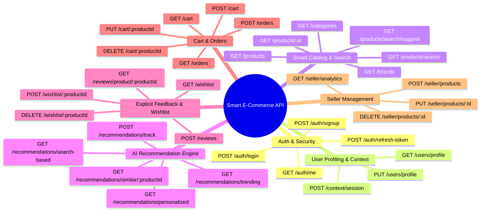

# API Architecture Blueprint: Smart E-Commerce & AI Recommendation System

Với vai trò **Kỹ sư Trưởng (Lead Fullstack & API Architect 10+ năm kinh nghiệm)**, bản kế hoạch này quy định toàn bộ danh mục **RESTful API Endpoint Specs** cho Hệ thống E-Commerce Gợi Ý Thông Minh. 

Hệ thống API được thiết kế theo chuẩn **Enterprise RESTful**, bảo mật với **JWT Bearer Authentication**, định dạng chuẩn hóa JSON, phân quyền chặt chẽ (Customer / Seller / Admin) và tối ưu hóa thời gian phản hồi (Low Latency Response) cho các thuật toán gợi ý thời gian thực.

---

## 🏗 Chuẩn Thiết Kế API & Format Phản Hồi (API Standards & Conventions)

- **Base URL**: `http://localhost:5000/api/v1`
- **Authentication**: `Authorization: Bearer <jwt_access_token>`
- **Content-Type**: `application/json`

### Standard Response Format:
```json
{
  "success": true,
  "message": "Thành công",
  "data": { ... },
  "pagination": {
    "page": 1,
    "limit": 20,
    "total": 100,
    "totalPages": 5
  }
}
```

---

## 📋 Danh Mục Chi Tiết 35 API Endpoints Theo Phân Hệ



---

## 🛠 Chi Tiết Tất Cả Các Endpoint

### 1. Phân Hệ Xác Thực & Bảo Mật (`/api/v1/auth`)

| HTTP Method | Endpoint Path | Role Allowed | Mô tả chức năng | Body / Params |
| :--- | :--- | :--- | :--- | :--- |
| `POST` | `/auth/signup` | Public | Đăng ký tài khoản mới | `{ username, password, email, role: "customer"\|"seller" }` |
| `POST` | `/auth/login` | Public | Đăng nhập & Nhận JWT Access Token | `{ username, password }` |
| `GET` | `/auth/me` | Authenticated | Lấy thông tin tài khoản hiện tại | Header `Authorization` |
| `POST` | `/auth/refresh-token` | Authenticated | Làm mới Token hết hạn | `{ refreshToken }` |
| `POST` | `/auth/logout` | Authenticated | Đăng xuất & Hủy phiên | Header `Authorization` |

---

### 2. Phân Hệ Chân Dung & Ngữ Cảnh Người Dùng (`/api/v1/users` & `/api/v1/context`)

> [!TIP]
> Nhóm API này thu thập thông tin nhân khẩu học (demographics) và ngữ cảnh thực tế (khung giờ mua sắm, thiết bị) nhằm giúp thuật toán cá nhân hóa chính xác hơn.

| HTTP Method | Endpoint Path | Role Allowed | Mô tả chức năng | Body / Params |
| :--- | :--- | :--- | :--- | :--- |
| `GET` | `/users/profile` | Customer | Lấy thông tin Profile chi tiết & Sở thích | Header `Authorization` |
| `PUT` | `/users/profile` | Customer | Cập nhật Profile (vùng miền, tuổi, ngân sách, `preferred_categories`) | `{ full_name, gender, date_of_birth, city, preferred_categories: [1,2], price_sensitivity }` |
| `POST` | `/context/session` | Public / Auth | Ghi nhận Ngữ cảnh phiên làm việc | `{ session_id, device_type, os_platform, time_slot }` |

---

### 3. Phân Hệ Danh Mục, Tìm Kiếm & Sản Phẩm (`/api/v1/products`)

> [!IMPORTANT]
> **Smart Search APIs**: Kết hợp Fulltext Search trên MySQL với cơ chế ghi nhận log tự động vào `search_logs` để phân tích xu hướng và đề xuất từ khóa.

| HTTP Method | Endpoint Path | Role Allowed | Mô tả chức năng | Body / Params |
| :--- | :--- | :--- | :--- | :--- |
| `GET` | `/categories` | Public | Lấy cây danh mục 2 cấp (Level 1 & Level 2) | None |
| `GET` | `/brands` | Public | Lấy danh sách thương hiệu chính hãng | None |
| `GET` | `/products` | Public | Danh sách sản phẩm (hỗ trợ phân trang, lọc giá, category) | `?category=1&min_price=100000&sort=popularity&page=1` |
| `GET` | `/products/:id` | Public | Chi tiết sản phẩm kèm thuộc tính EAV & chỉ số metrics | Route param `id` |
| `GET` | `/products/search/suggest` | Public | **Auto-complete**: Gợi ý từ khóa & sản phẩm theo thời gian thực khi gõ | `?q=laptop` (Debounce 300ms) |
| `GET` | `/products/search` | Public / Auth | **Smart Search**: Tìm kiếm đầy đủ, tự động lưu nhật ký `search_logs` | `?q=iphone+15+pro&category=2&sort=price_asc` |

---

### 4. Phân Hệ Gợi Ý Thông Minh & Behavioral Tracking (`/api/v1/recommendations`)

> [!CAUTION]
> Trọng tâm của hệ thống AI Recommendation: Tích hợp ghi nhận 10 loại tương tác thụ động (Implicit Feedback) và tính toán điểm tương đồng đa chiều.

| HTTP Method | Endpoint Path | Role Allowed | Mô tả chức năng | Body / Params |
| :--- | :--- | :--- | :--- | :--- |
| `POST` | `/recommendations/track` | Authenticated | **Implicit Feedback Log**: Ghi nhận hành vi (`product_view`, `dwell_time_high`, `cart_add`, `share`...) | `{ product_id, action_type, dwell_seconds, session_id }` |
| `GET` | `/recommendations/personalized` | Authenticated | **Personalized AI Feed**: Lấy danh sách gợi ý cá nhân hóa dựa trên Content-Based + Trọng số hành vi | `?limit=12` |
| `GET` | `/recommendations/similar/:productId` | Public | **Similar Products**: Lấy sản phẩm tương đồng dựa trên Cosine Similarity (TF-IDF + EAV Attributes) | Route param `productId`, `?limit=6` |
| `GET` | `/recommendations/trending` | Public | **Trending Products**: Sản phẩm nổi bật xếp hạng theo `popularity_score` | `?limit=10` |
| `GET` | `/recommendations/search-based` | Authenticated | **Contextual Recommendation**: Gợi ý sản phẩm liên quan tới các từ khóa vừa tìm kiếm gần đây | `?limit=6` |

---

### 5. Phân Hệ Đánh Giá Chủ Động & Yêu Thích (`/api/v1/reviews` & `/api/v1/wishlist`)

| HTTP Method | Endpoint Path | Role Allowed | Mô tả chức năng | Body / Params |
| :--- | :--- | :--- | :--- | :--- |
| `GET` | `/wishlist` | Customer | Lấy danh sách sản phẩm yêu thích | Header `Authorization` |
| `POST` | `/wishlist/:productId` | Customer | Thêm sản phẩm vào Wishlist (Tự động phát sinh `wishlist_add` track, weight=3) | Route param `productId` |
| `DELETE` | `/wishlist/:productId` | Customer | Xóa khỏi Wishlist | Route param `productId` |
| `POST` | `/reviews` | Customer | Đánh giá chủ động sản phẩm (Rating 1-5 sao, bình luận, ảnh) -> Cập nhật metrics | `{ product_id, order_id, rating: 5, comment, images: [] }` |
| `GET` | `/reviews/product/:productId` | Public | Lấy danh sách đánh giá của sản phẩm | Route param `productId`, `?page=1` |

---

### 6. Phân Hệ Giỏ Hàng & Đặt Hàng Thương Mại (`/api/v1/cart` & `/api/v1/orders`)

| HTTP Method | Endpoint Path | Role Allowed | Mô tả chức năng | Body / Params |
| :--- | :--- | :--- | :--- | :--- |
| `GET` | `/cart` | Customer | Lấy danh sách sản phẩm trong giỏ hàng | Header `Authorization` |
| `POST` | `/cart` | Customer | Thêm vào giỏ (Tự động phát sinh `cart_add` track, weight=4) | `{ product_id, quantity: 1 }` |
| `PUT` | `/cart/:productId` | Customer | Cập nhật số lượng sản phẩm | `{ quantity: 2 }` |
| `DELETE` | `/cart/:productId` | Customer | Xóa sản phẩm khỏi giỏ (Phát sinh `cart_remove` track, weight=-2) | Route param `productId` |
| `POST` | `/orders` | Customer | Tiến hành đặt hàng (Phát sinh `purchase` track, weight=5, trừ tồn kho) | `{ shipping_address, payment_method: "cod" }` |
| `GET` | `/orders` | Customer | Danh sách lịch sử đơn hàng | Header `Authorization` |
| `GET` | `/orders/:id` | Customer | Chi tiết đơn hàng | Route param `id` |

---

### 7. Phân Hệ Quản Lý Dành Cho Người Bán (`/api/v1/seller`)

| HTTP Method | Endpoint Path | Role Allowed | Mô tả chức năng | Body / Params |
| :--- | :--- | :--- | :--- | :--- |
| `GET` | `/seller/products` | Seller | Lấy danh sách sản phẩm do Seller đăng bán | Header `Authorization` |
| `POST` | `/seller/products` | Seller | Tạo sản phẩm mới kèm danh mục, thương hiệu, tags & thuộc tính EAV | `{ name, category_id, brand_id, price, original_price, stock, image_url, tags, attributes: [{ key, value }] }` |
| `PUT` | `/seller/products/:id` | Seller | Cập nhật thông tin & thuộc tính sản phẩm | Body như POST |
| `DELETE` | `/seller/products/:id` | Seller | Ngừng kinh doanh sản phẩm (đổi `status='archived'`) | Route param `id` |
| `GET` | `/seller/analytics` | Seller | Báo cáo thống kê lượt xem, tỷ lệ chuyển đổi (CR) và doanh thu | `?timeframe=30days` |

---

## 🧪 Verification Plan

### 1. Automated Verification (API Integration Tests)
- Kiểm tra toàn bộ 35 Endpoints phản hồi chuẩn format JSON HTTP status codes (`200 OK`, `201 Created`, `400 Bad Request`, `401 Unauthorized`, `403 Forbidden`, `404 Not Found`).
- Kiểm tra JWT Auth Middleware bảo vệ chính xác các route dành riêng cho Customer & Seller.

### 2. Manual End-to-End Verification (Recommendation Data Flow)
- **Tracking -> Recommendation Loop**:
  1. Đăng nhập Customer -> Gọi `POST /recommendations/track` với `action_type = "product_view"` sản phẩm Laptop ASUS.
  2. Gọi `GET /recommendations/personalized` -> Xác minh danh sách gợi ý trả về chứa các sản phẩm liên quan đến Laptop / Phụ kiện gaming có `recommendationScore > 0`.
- **Search -> Auto-complete -> Search Log Loop**:
  1. Gõ từ khóa `POST /products/search/suggest?q=iphone`.
  2. Tìm kiếm `GET /products/search?q=iphone+15`.
  3. Kiểm tra DB `search_logs` ghi nhận từ khóa `iphone 15` và `normalized_query = 'iphone 15'`.
