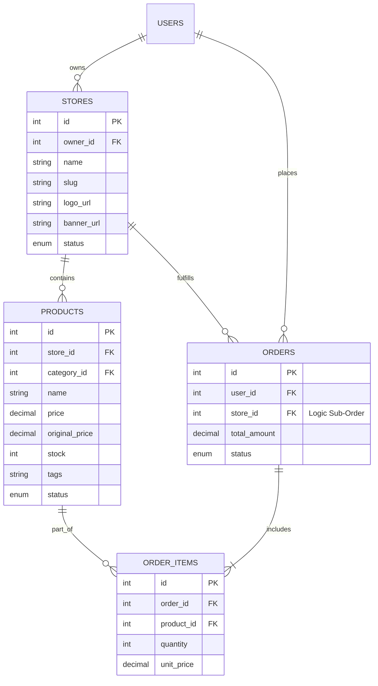
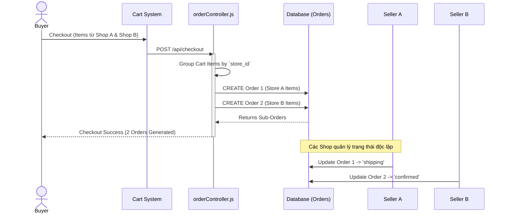
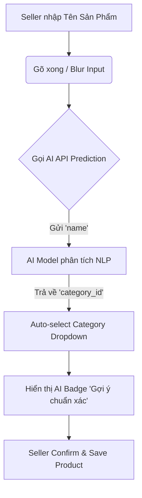

# 🚀 BÁO CÁO BẢO VỆ ĐỒ ÁN MÔN HỌC
## PHÂN HỆ: SELLER PORTAL & MULTI-STORE ORDER FULFILLMENT
**Sinh viên thực hiện:** Cao Thành Long (Member 2)
**Vai trò:** Seller Portal & Multi-Store Order Fulfillment Engineer
**Chuyên môn:** Phát triển Kênh Người Bán (Seller Dashboard), Quản lý Sản Phẩm CRUD, Dự đoán Danh mục AI, Thống kê Doanh Thu và Kiến trúc Tách Đơn Hàng Đa Gian Hàng (Multi-Store Sub-Order Architecture).

---

## 🎯 1. PHẠM VI CÔNG VIỆC & TÍNH NĂNG CHÍNH

### 1.1. Quản Lý Sản Phẩm & Tích Hợp AI Prediction (Products CRUD)
- **Quản lý toàn diện (CRUD):** Xây dựng giao diện và API Thêm, Sửa, Xóa, Tìm kiếm sản phẩm dành riêng cho từng Shop (Gian hàng).
- **AI Category Prediction (Badge):** Tích hợp AI để tự động phân tích Tên sản phẩm, từ đó gợi ý Danh mục chuẩn xác nhất (hiển thị dưới dạng Badge nổi bật).
- **Quản lý dữ liệu lõi:** Tồn kho (stock), giá bán (price), giá gốc (original_price) và thẻ (tags).

### 1.2. Kiến Trúc Tách Đơn Hàng Đa Gian Hàng (Multi-Store Sub-Order Architecture)
- **Xử lý Checkout phức tạp:** Giải quyết bài toán thanh toán một giỏ hàng chứa nhiều sản phẩm thuộc các Shop khác nhau.
- **Cơ chế Split Order (Tách đơn):** Hệ thống tự động nhóm các sản phẩm theo `store_id` và tách thành các "Đơn hàng con" (Sub-Order) độc lập.
- **Độc lập trạng thái:** Trạng thái của từng Sub-Order là hoàn toàn riêng biệt. Khi Shop A cập nhật đơn thành "Đang giao hàng" (Shipping), đơn của Shop B vẫn giữ nguyên trạng thái ban đầu (Pending/Confirmed).
- **Luồng trạng thái chuẩn:** `Pending` $\rightarrow$ `Confirmed` $\rightarrow$ `Shipping` $\rightarrow$ `Completed` / `Cancelled`.

### 1.3. Quản Lý Gian Hàng & Thống Kê Tài Chính (Seller Dashboard)
- **Tab Tổng Quan & Tài Chính:**
  - 4 Thẻ thống kê (Metric Cards): Tổng doanh thu, Số lượng đơn hàng, Tổng sản phẩm, Số đánh giá.
  - Biểu đồ Bar Chart: Thống kê và trực quan hóa doanh thu trong 6 tháng gần nhất.
- **Tab Quản Lý Gian Hàng:**
  - **Multi-Store Switcher:** Hỗ trợ chủ tài khoản quản lý và chuyển đổi nhanh giữa nhiều gian hàng.
  - Tùy chỉnh thông tin: Cập nhật Logo URL, Banner URL với tính năng Live Preview trực quan ngay trên giao diện.

---

## 🗄️ 2. PHÂN TÍCH THIẾT KẾ CƠ SỞ DỮ LIỆU (DATABASE DESIGN)

Phân hệ sử dụng các bảng dữ liệu cốt lõi sau để đảm bảo tính toàn vẹn của Kiến trúc Đa gian hàng (Multi-vendor).

### 2.1. Sơ đồ Thực thể Liên kết (ERD)

### 2.2. Các Thuộc Tính Quan Trọng Bắt Buộc

1. **Bảng `STORES` (Gian hàng):**
   - `owner_id` (Bắt buộc): Liên kết gian hàng với tài khoản người bán (`users`). Quyết định quyền truy cập Dashboard.
   - `name`, `slug` (Bắt buộc, Unique): Định danh gian hàng trên hệ thống URL.
   - `logo_url`, `banner_url`: Phục vụ tính năng UI Live Preview trên Seller Dashboard.

2. **Bảng `PRODUCTS` (Sản phẩm):**
   - `store_id` (Bắt buộc): Phân định sản phẩm thuộc về gian hàng nào (Cốt lõi cho tính năng tách đơn).
   - `price`, `original_price` (Bắt buộc): Tính toán doanh thu và % giảm giá.
   - `stock` (Bắt buộc): Quản lý tồn kho thực tế của Seller.
   - `predicted_category`: Lưu trữ kết quả phân tích từ AI Category Prediction.

3. **Bảng `ORDERS` & `ORDER_ITEMS` (Đơn hàng Sub-Order):**
   - Cốt lõi của *Multi-Store Sub-Order*: Tại tầng Logic (Controller), một lần Checkout sẽ sinh ra **N** bản ghi `ORDERS` (mỗi Order tương ứng với 1 `store_id` tập hợp các `ORDER_ITEMS` của store đó).
   - `status` (Bắt buộc): Quản lý luồng trạng thái độc lập (`pending`, `confirmed`, `processing`, `shipping`, `completed`, `cancelled`).

---

## ⚙️ 3. SƠ ĐỒ LUỒNG XỬ LÝ (SYSTEM FLOWS)

### 3.1. Luồng Tách Đơn Hàng Đa Gian Hàng (Split-Order Flow)

### 3.2. Luồng Dự Đoán Danh Mục bằng AI (AI Prediction Flow)

---

## 📁 4. CẤU TRÚC MÃ NGUỒN PHỤ TRÁCH

Để minh chứng cho khối lượng công việc, dưới đây là các tệp tin source code do **Cao Thành Long** trực tiếp thiết kế và lập trình:

**Giao diện (Frontend - ReactJS):**
- 📄 `frontend/src/pages/SellerDashboard.jsx` (Giao diện Kênh Người Bán 4 Tab)
- 📄 `frontend/src/pages/SellerDashboard.css` (Style tùy biến)
- 📄 `frontend/src/api/sellerApi.js` (API Client tương tác backend Kênh Người Bán)

**Xử lý nghiệp vụ (Backend - Node.js/Express):**
- 📄 `backend/services/sellerService.js` (Logic tính toán thống kê doanh thu 6 tháng, thông tin gian hàng)
- 📄 `backend/controllers/sellerController.js` (API Controller xử lý yêu cầu Seller Dashboard)
- 📄 `backend/controllers/productController.js` (API CRUD Sản phẩm & gọi AI Model)
- 📄 `backend/controllers/orderController.js` (Nghiệp vụ Tách đơn hàng - Group by store_id)
- 📄 `backend/routes/sellerRoutes.js` (Định tuyến API riêng tư bảo mật bằng JWT cho người bán)
