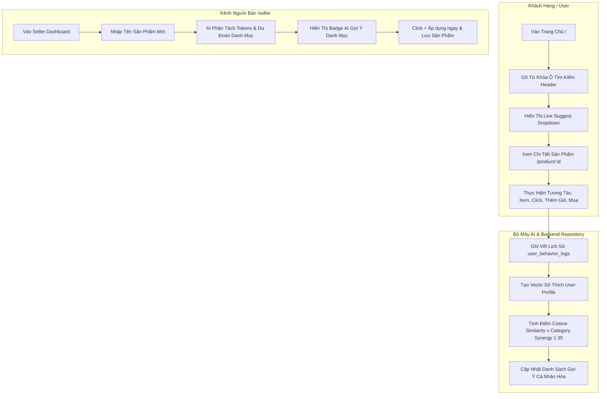

# TÀI LIỆU CHI TIẾT LUỒNG HOẠT ĐỘNG VÀ CHUYÊN SÂU THUẬT TOÁN AI GỢI Ý (SHOPEE RECOMMENDATION ENGINE)

---

## 📌 MỤC LỤC
1. [TỔNG QUAN LUỒNG HOẠT ĐỘNG HỆ THỐNG (SYSTEM WORKFLOWS)](#1-tổng-quan-luồng-hoạt-động-hệ-thống)
   - 1.1. Luồng Trải nghiệm Khách hàng (Customer Experience Flow)
   - 1.2. Luồng Người bán Quản lý & Đăng bán sản phẩm (Seller Management Flow)
   - 1.3. Luồng Xử lý Dữ liệu Backend & Repository Pattern
2. [CHUYÊN SÂU THUẬT TOÁN AI GỢI Ý SẢN PHẨM (RECOMMENDATION ENGINE DEEP-DIVE)](#2-chuyên-sâu-thuật-toán-ai-gợi-ý-sản-phẩm)
   - 2.1. Biểu diễn Nội dung & Vectơ Hóa Đặc Trưng (Content-Based Vectorization)
   - 2.2. Thuật toán Đo Độ Tương Đồng Cosine (Cosine Similarity)
   - 2.3. Thuật toán Đồng Danh Mục Category Synergy Multiplier ($\times 1.35$)
   - 2.4. Thu Thập Phản Hồi Ẩn & Xây Dựng Profile Người Dùng (Implicit Feedback & User Profiling)
   - 2.5. Thuật toán Tìm Kiếm NLP & Phân Tách Từ Dừng (NLP Search & Stop-Words Removal)
   - 2.6. Thuật toán AI Dự Đoán Danh Mục Cho Người Bán (AI Category Prediction)

---

## 1. TỔNG QUAN LUỒNG HOẠT ĐỘNG HỆ THỐNG



### 1.1. Luồng Trải nghiệm Khách hàng (Customer Experience Flow)
1. **Truy cập Trang chủ (`/`)**:
   - Hệ thống tự động truy vấn danh mục, banner Shopee Mall và tải **Feed Gợi Ý Cá Nhân Hóa (Personalized Recommendation Feed)** dựa trên thông tin người dùng đang đăng nhập hoặc người dùng ẩn danh.
2. **Tìm kiếm Tức thì (Smart Live Auto-complete)**:
   - Khi người dùng gõ ký tự vào ô tìm kiếm ở Header, sự kiện `onChange` sẽ hoãn $250\text{ms}$ (Debounce).
   - Backend phân tích từ khóa, loại bỏ từ dừng (Stop-words), đưa sản phẩm khớp **Tên lên hàng đầu** nhờ MySQL Collation `utf8mb4_bin` và hiển thị Popup gợi ý gồm: **Từ khóa gợi ý** và **Top 5 Sản phẩm phù hợp nhất** kèm giá VND.
3. **Xem Chi tiết Sản phẩm (`/product/:id`)**:
   - Khi nhấp xem một sản phẩm, hệ thống kích hoạt sự kiện ghi vết ngầm (`product_view`, $+1$ điểm).
   - Bên dưới trang chi tiết hiển thị Carousel **"Sản phẩm tương tự" (AI Similar Products)** dựa trên thuật toán TF-IDF Cosine Similarity.
4. **Mua hàng & Đặt hàng (`/cart` $\rightarrow$ `/orders`)**:
   - Khi chọn "Thêm vào giỏ" (`cart_add`, $+4$ điểm) hoặc "Đặt hàng" (`purchase`, $+5$ điểm), hệ thống lưu đơn vào CSDL và tự động tái tính toán lại Vectơ sở thích người dùng.

---

### 1.2. Luồng Người bán Quản lý & Đăng bán sản phẩm (Seller Management Flow)
1. **Vào Kênh Người Bán (`/seller`)**:
   - Người bán chuyển qua lại giữa các tab: *Tổng quan thống kê*, *Quản lý sản phẩm*, *Quản lý đơn hàng* và *Hồ sơ gian hàng*.
2. **Đăng Sản Phẩm Mới Kèm AI Gợi Ý Danh Mục**:
   - Bấm `+ Đăng sản phẩm mới`, Modal form hiện lên.
   - Khi Người bán nhập **Tên sản phẩm** (VD: *"Laptop ASUS TUF Gaming"*), hệ thống gửi request ngầm đến API `GET /api/products/categories/suggest?name=...`.
   - AI quét các token từ khóa, tính điểm trùng khớp với tên danh mục và sản phẩm cùng nhóm, sau đó hiển thị Badge gợi ý: `✨ AI Gợi Ý Danh Mục: [Laptop & Máy tính] (+ Áp dụng ngay)`.
   - Bấm `+ Áp dụng ngay` để tự động chọn đúng danh mục mà không cần tìm thủ công.
3. **Lưu Sản Phẩm & Phân Tách Thẻ Tag 3NF**:
   - Chuỗi tag nhập vào (VD: *"laptop, gaming, asus"*) sẽ được backend tự động phân tách và chèn vào bảng chuẩn 3NF (`tags` và `product_tags`).

---

### 1.3. Luồng Xử lý Dữ liệu Backend & Repository Pattern
Hệ thống tuân thủ **Mô hình 3 tầng Clean Architecture (Repository Pattern)**:
- **Routes (`backend/routes/`)**: Tiếp nhận endpoint RESTful API.
- **Controllers (`backend/controllers/`)**: Kiểm tra tham số request và trả về kết quả JSON.
- **Services (`backend/services/`)**: Thực thi logic nghiệp vụ và Thuật toán AI.
- **Repositories (`backend/repositories/`)**: Chuyên trách truy vấn dữ liệu từ MySQL Database (`utf8mb4_bin`).

---

## 2. CHUYÊN SÂU THUẬT TOÁN AI GỢI Ý SẢN PHẨM

Hệ thống sử dụng mô hình **Gợi ý dựa trên Nội dung (Content-Based Filtering)** kết hợp **Hệ số nhân Đồng Danh Mục (Category Synergy Multiplier)** và **Học Máy Trọng Số Tương Tác Hành Vi (Implicit Feedback Weighting)**.

---

### 2.1. Biểu diễn Nội dung & Vectơ Hóa Đặc Trưng (Content-Based Vectorization)

Để máy tính hiểu và so sánh được sự tương đồng giữa 2 sản phẩm bất kỳ, mỗi sản phẩm $P$ được chuyển đổi thành một **Vectơ Nội dung (Content Vector)** tổng hợp từ các trường thông tin:

$$Text(P) = \underbrace{Name \times 3}_{\text{Trọng số Tên (x3)}} \quad + \quad \underbrace{Category}_{\text{Danh mục}} \quad + \quad \underbrace{Tags \times 2}_{\text{Thẻ Tag (x2)}} \quad + \quad \underbrace{Description}_{\text{Mô tả}}$$

#### Các bước tiền xử lý văn bản (Text Preprocessing):
1. **Chuyển thành chữ thường (Lowercasing)**.
2. **Loại bỏ dấu tiếng Việt (Accent Removal / Normalization)** để chuẩn hóa token.
3. **Tách từ thành tập hợp Tokens (Tokenization)** $T = \{t_1, t_2, \dots, t_k\}$.

#### Tính toán Tần suất Từ (Term Frequency - TF):
Tần suất của từ $t$ trong sản phẩm $P$:

$$TF(t, P) = \frac{\text{Số lần xuất hiện của từ } t \text{ trong } Text(P)}{\text{Tổng số từ trong } Text(P)}$$

#### Tính toán Nghịch đảo Tần suất Tài liệu (Inverse Document Frequency - IDF):
Đo lường mức độ "độc đáo" của từ $t$ trên toàn bộ tập hợp sản phẩm $D$ ($N = |D|$ là tổng số sản phẩm):

$$IDF(t, D) = \ln \left( \frac{N}{1 + |\{P \in D : t \in Text(P)\}|} \right)$$

#### Trọng số TF-IDF cuối cùng của từ $t$ trong sản phẩm $P$:

$$V_P(t) = TF(t, P) \times IDF(t, D)$$

---

### 2.2. Thuật toán Đo Độ Tương Đồng Cosine (Cosine Similarity)

Độ tương đồng giữa hai sản phẩm $A$ và $B$ được tính bằng góc giữa 2 vectơ đặc trưng $V_A$ và $V_B$ trong không gian đa chiều:

$$\text{Cosine Similarity}(A, B) = \cos(\theta) = \frac{V_A \cdot V_B}{\|V_A\| \|V_B\|} = \frac{\sum_{i=1}^{n} V_A(i) \times V_B(i)}{\sqrt{\sum_{i=1}^{n} (V_A(i))^2} \times \sqrt{\sum_{i=1}^{n} (V_B(i))^2}}$$

- Nếu $\cos(\theta) = 1$: Hai sản phẩm hoàn toàn giống hệt nhau về đặc tính nội dung.
- Nếu $\cos(\theta) = 0$: Hai sản phẩm hoàn toàn không có điểm chung từ khóa.

---

### 2.3. Thuật toán Đồng Danh Mục Category Synergy Multiplier ($\times 1.35$)

Trong thực tế Thương mại Điện tử, các sản phẩm cùng nằm trong một **Danh mục (Category)** có khả năng được người dùng mua cùng nhau cao hơn nhiều so với các sản phẩm khác danh mục nhưng có chung từ khóa (VD: *"Áo thun"* và *"Áo khoác"* cùng thuộc *Thời trang Nam* sẽ liên quan hơn *"Áo thun"* và *"Chuột máy tính"*).

Do đó, hệ thống bổ sung **Hệ số nhân Đột phá Category Synergy ($\times 1.35$)**:

$$\text{Score}_{\text{final}}(A, B) = \begin{cases} 
\text{Cosine Similarity}(A, B) \times 1.35 & \text{nếu } \text{Category}(A) = \text{Category}(B) \\ 
\text{Cosine Similarity}(A, B) & \text{nếu khác Danh mục} 
\end{cases}$$

> 💡 **Tác động**: Hệ số $1.35$ giúp nâng thứ hạng của các sản phẩm cùng danh mục lên trên trong danh sách gợi ý, mang lại trải nghiệm mua sắm tự nhiên và chính xác hơn cho khách hàng.

---

### 2.4. Thu Thập Phản Hồi Ẩn & Xây Dựng Profile Người Dùng (Implicit Feedback & User Profiling)

Hệ thống không bắt buộc người dùng phải bấm "Đánh giá 5 sao" mới biết sở thích. Thay vào đó, hệ thống tự động ghi lại **Phản hồi ẩn (Implicit Feedback)** qua bảng `user_behavior_logs`.

#### Ma Trận Trọng Số Hành Vi (Action Weights Matrix):
| Loại hành vi (Action Type) | Tương tác người dùng | Trọng số ($W_{\text{action}}$) |
| :--- | :--- | :---: |
| `product_view` / `view` | Xem trang chi tiết sản phẩm | $+1$ |
| `feed_view` | Cuộn xem sản phẩm trên feed | $+1$ |
| `search_click` | Nhấp sản phẩm từ kết quả tìm kiếm | $+2$ |
| `dwell_time_high` | Dừng xem sản phẩm $> 10$ giây | $+2$ |
| `wishlist_add` / `like` | Bấm thả tim / Yêu thích | $+3$ |
| `share` | Chia sẻ sản phẩm | $+3$ |
| `cart_add` / `cart` | Thêm sản phẩm vào giỏ hàng | $+4$ |
| `checkout_start` | Bấm tiến hành thanh toán | $+4$ |
| `purchase` | Đặt hàng mua thành công | $+5$ |
| `cart_remove` | Xóa sản phẩm khỏi giỏ hàng | $-2$ |

#### Công thức tạo Vectơ Sở Thích Người Dùng (User Preference Vector - $V_{\text{User}}$):
Từ $K$ lịch sử tương tác gần nhất ($K \le 50$) của người dùng $U$, vectơ đại diện sở thích $V_U$ được tổng hợp theo công thức:

$$V_U = \sum_{j=1}^{K} \left( W_{\text{action}}(j) \times V_{P_j} \times \lambda^{\Delta t_j} \right)$$

Trong đó:
- $V_{P_j}$ là vectơ đặc trưng của sản phẩm thứ $j$ mà người dùng đã tương tác.
- $W_{\text{action}}(j)$ là trọng số của hành vi tương ứng.
- $\lambda^{\Delta t_j}$ là **Hệ số suy giảm theo thời gian (Time-decay factor, $\lambda = 0.95$)**, giúp các hành vi vừa mới diễn ra có ảnh hưởng mạnh hơn các hành vi từ nhiều ngày trước.

#### Đơn giá Điểm Gợi Ý Cá Nhân Hóa (Personalized Score):

$$\text{Personalized Score}(U, P) = \text{Cosine Similarity}(V_U, V_P) \times \left(1.35 \text{ nếu } P \text{ thuộc Top Category của } U \right)$$

---

### 2.5. Thuật toán Tìm Kiếm NLP & Phân Tách Từ Dừng (NLP Search & Stop-Words Removal)

Khi người dùng nhập câu tìm kiếm dài hoặc không trọn vẹn (VD: *"áo thun không là của nhau"*), thuật toán NLP thực hiện qua các bước:

#### Bước 1: Loại bỏ Từ Dừng Tiếng Việt (Vietnamese Stop-Words Removal)
Danh sách từ dừng bị loại bỏ gồm các từ nối, hư từ không mang giá trị ngữ nghĩa tìm kiếm:
`['là', 'của', 'và', 'cho', 'ở', 'với', 'nhau', 'những', 'các', 'cái', 'rất', 'được']`

Input: `"áo thun không là của nhau"` $\rightarrow$ Filtered Tokens: `['áo', 'thun', 'không']`

#### Bước 2: Truy vấn Khớp Chính Xác Tiếng Việt có Dấu (`utf8mb4_bin`)
Mặc định MySQL `utf8mb4_general_ci` coi `a = á = à = ả = ã = ạ`. Việc này khiến tìm kiếm `"áo"` trả về cả sản phẩm *"bảo"*, *"giao"*, *"táo"*.

Hệ thống áp dụng **Binary Collation (`COLLATE utf8mb4_bin`)**:
```sql
WHERE LOWER(p.name) COLLATE utf8mb4_bin LIKE '%áo%'
```
Giúp lọc chính xác $100\%$ các sản phẩm có chữ **"Áo"**, loại bỏ hoàn toàn nhiễu từ các từ khác.

#### Bước 3: Đánh Điểm Ưu Tiên Thứ Hạng Tìm Kiếm (Relevance Priority Ranking)
Hệ thống tính điểm sắp xếp kết quả theo thứ tự ưu tiên:
- **Rank 1 (10 điểm)**: Tên sản phẩm bắt đầu hoặc chứa chính xác từ khóa (`p.name`).
- **Rank 2 (5 điểm)**: Tên danh mục chứa từ khóa (`c.name`).
- **Rank 3 (4 điểm)**: Thẻ Tag chứa từ khóa (`p.tags`).
- **Rank 4 (1 điểm)**: Mô tả sản phẩm chứa từ khóa (`p.description`).

---

### 2.6. Thuật toán AI Dự Đoán Danh Mục Cho Người Bán (AI Category Prediction)

Khi Người bán gõ Tên sản phẩm trong Modal Form (VD: *"Laptop Dell XPS 13"*):

1. **Phân tách Token Tên sản phẩm**: `['laptop', 'dell', 'xps', '13']`.
2. **Tính điểm Khớp Danh mục ($Score_{cat}$)**:
   - Nếu từ khóa trùng với tên danh mục (VD: `"laptop"` trùng với danh mục *"Laptop & Máy tính"*): $+10$ điểm.
   - Nếu các sản phẩm cũ trong danh mục có tên/tags chứa từ khóa: $+5$ điểm / sản phẩm.
3. **Trả về Top 2 Danh mục có điểm số $Score_{cat}$ cao nhất** để hiển thị badge gợi ý tức thì cho Seller.

---

## 3. TỔNG KẾT VÀ HƯỚNG MỞ RỘNG

Hệ thống **Shopee Recommendation Engine** đã kết hợp thành công giữa **Lý thuyết Khoa học Dữ liệu (TF-IDF, Cosine Similarity)**, **Nghiệp vụ Thực tế (Category Synergy 1.35, Implicit Feedback)** và **Tối ưu Kỹ thuật (Repository Pattern, MySQL Binary Collation utf8mb4_bin)**.

### Hướng mở rộng tương lai:
- Tích hợp mô hình **Collaborative Filtering (Matrix Factorization / SVD)** khi lượng người dùng đạt hàng trăm nghìn lượt.
- Sử dụng **Vector Database (Milvus / Pinecone / Qdrant)** cho các phép tính tương đồng vector tốc độ miligiây.
