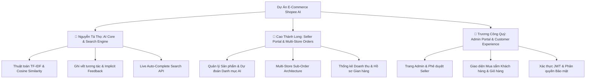

# PHÂN CHIA MODULE DỰ ÁN CHO 3 THÀNH VIÊN (TEAM WORK DIVISION DOCUMENT)

Dự án **E-Commerce Shopee Clone tích hợp Động Cơ Gợi Ý Sản Phẩm AI (Content-Based Filtering & Multi-Store Management)** được phân chia rõ ràng thành **3 Module độc lập** dành cho **3 thành viên** nhằm tối ưu hóa tiến độ làm việc, tránh xung đột mã nguồn (Git conflict) và đảm bảo tính chuyên môn hóa cao.

---

## 📌 THÔNG TIN NHÓM VÀ TỔNG QUAN PHÂN CÔNG

| STT | Họ và Tên | Vai trò & Module Phụ Trách | Chuyên Môn Chính |
| :---: | :--- | :--- | :--- |
| 1 | **Nguyễn Tá Thọ** | **Member 1**: AI Core, Data Engine & Recommendation System Engineer | Thuật toán AI TF-IDF, Cosine Similarity, Tracking Hành Vi, Live Search |
| 2 | **Cao Thành Long** | **Member 2**: Seller Portal & Multi-Store Order Fulfillment Engineer | Kênh Người Bán, Products CRUD, AI Category Prediction, Tách Đơn Đa Shop |
| 3 | **Trương Công Quý** | **Member 3**: Admin Portal, User Management & Customer Experience Engineer | Trang Admin Portal, Phê Duyệt Seller, UI Mua Sắm, Auth JWT & Phân Quyền |

---

---

## 👤 NGUYỄN TÁ THỌ (MEMBER 1): AI CORE, DATA ENGINE & RECOMMENDATION SYSTEM ENGINEER
> **Chuyên môn**: Xây dựng thuật toán AI Core, Tiền xử lý Ngôn ngữ Tự nhiên (NLP), Vectơ hóa TF-IDF, Thuật toán Cosine Similarity và Hệ thống Gợi ý Cá nhân hóa.

### 🎯 Scope Công Việc & Nhiệm Vụ Chi Tiết:
1. **Động Cơ AI Core (`recommendationEngine.js`)**:
   - Tiền xử lý văn bản: Tách từ tiếng Việt, chuyển chữ thường, loại bỏ ký tự đặc biệt và bộ từ dừng (**Stop Words**).
   - Biểu diễn Sản phẩm dưới dạng không gian Véc-tơ đa chiều:
     - Tần suất từ $\text{TF}(t, d) = \frac{f_{t, d}}{\sum f}$.
     - Nghịch đảo tần suất tài liệu mượt $\text{IDF}(t, D) = \ln\left(1 + \frac{N}{\text{DF}(t)}\right) + 1$.
     - Tính độ dài Euclid (Magnitude / L2-Norm): $\|\vec{V}\| = \sqrt{\sum \text{TFIDF}^2}$.
   - Đo góc tương đồng ngữ nghĩa bằng **Cosine Similarity**: $\cos(\theta) = \frac{\vec{A} \cdot \vec{B}}{\|\vec{A}\| \|\vec{B}\|}$.
   - Tích hợp hệ số cộng hưởng danh mục **Category Synergy Boost** ($\times 1.10 - 1.35$).

2. **Hệ Thống Ghi Vết Hành Vi Khách Hàng (Implicit Feedback Tracking)**:
   - Quản lý ma trận trọng số hành vi: Xem trang ($+1$), Click tìm kiếm ($+2$), Thả tim ($+3$), Thêm giỏ ($+4$), Mua hàng ($+5$).
   - Chuẩn hóa thời gian dừng xem (**Dwell Time**) theo hàm $\log_2$.
   - Tổng hợp Véc-tơ Sở Thích Người Dùng ($\vec{U}$).

3. **Gợi Ý Tự Động & API Tìm Kiếm Tức Thì (Live Search Suggestion)**:
   - API gợi ý cá nhân hóa: `/api/recommendations/personalized`.
   - API sản phẩm tương tự: `/api/recommendations/similar/:id`.
   - API gợi ý từ khóa thông minh & tìm kiếm tức thì: `/api/products/search/suggest`.

### 📁 Tệp Tin Mã Nguồn Phụ Trách:
- 📄 `backend/utils/recommendationEngine.js` *(Động cơ AI tính toán toán học)*
- 📄 `backend/services/recommendationService.js` *(Tầng nghiệp vụ gợi ý)*
- 📄 `backend/controllers/recommendationController.js` *(Tầng điều hướng API)*
- 📄 `backend/routes/recommendationRoutes.js` *(Tầng định tuyến API)*
- 📄 `SYSTEM_FLOWS_AND_RECOMMENDATION_AI.md` & `CODE_EXPLANATION_RECOMMENDATION_AI.md` *(Tài liệu kỹ thuật AI)*

---

## 👤 CAO THÀNH LONG (MEMBER 2): SELLER PORTAL & MULTI-STORE ORDER FULFILLMENT ENGINEER
> **Chuyên môn**: Phát triển Kênh Người Bán (Seller Dashboard), Quản lý Sản Phẩm CRUD, Dự đoán Danh mục AI, Thống kê Doanh Thu và Kiến trúc Tách Đơn Hàng Đa Gian Hàng (Multi-Store Sub-Order Architecture).

### 🎯 Scope Công Việc & Nhiệm Vụ Chi Tiết:
1. **Quản Lý Sản Phẩm & Tích Hợp AI Prediction (Products CRUD)**:
   - Xây dựng giao diện & API Thêm, Sửa, Xóa, Tìm kiếm sản phẩm theo Shop.
   - Tích hợp Badge **Dự đoán Danh mục AI (AI Category Prediction)** tự động phân tích tên sản phẩm để gợi ý danh mục chuẩn xác nhất.
   - Quản lý tồn kho sản phẩm, giá bán, giá gốc và thẻ Tag.

2. **Kiến Trúc Tách Đơn Hàng Đa Gian Hàng (Multi-Store Sub-Order Architecture)**:
   - Xử lý bài toán thanh toán giỏ hàng chứa sản phẩm của nhiều Shop khác nhau: Tự động tách thành từng **Đơn hàng con (Sub-Order)** độc lập theo `store_id`.
   - Đảm bảo tính độc lập: Khi Shop A cập nhật trạng thái đơn sang *Đang giao hàng*, Đơn hàng của Shop B không bị ảnh hưởng.
   - Quản lý luồng trạng thái đơn hàng (*Pending $\rightarrow$ Confirmed $\rightarrow$ Shipping $\rightarrow$ Completed / Cancelled*).

3. **Quản Lý Gian Hàng & Thống Kê Tài Chính (Seller Dashboard)**:
   - Xây dựng Tab **Tổng Quan & Tài Chính**: 4 thẻ thống kê (Doanh thu, Đơn hàng, Sản phẩm, Đánh giá) và biểu đồ cột doanh thu 6 tháng.
   - Tab **Quản Lý Gian Hàng**: Đa gian hàng (Multi-Store Switcher), cập nhật Logo URL, Banner URL và Live Preview banner trực quan.

### 📁 Tệp Tin Mã Nguồn Phụ Trách:
- 📄 `frontend/src/pages/SellerDashboard.jsx` & `SellerDashboard.css` *(Giao diện Kênh Người Bán 4 Tab)*
- 📄 `frontend/src/api/sellerApi.js` *(API Client Kênh Người Bán)*
- 📄 `backend/services/sellerService.js` *(Nghiệp vụ tài chính, gian hàng & đơn bán)*
- 📄 `backend/controllers/sellerController.js` & `productController.js` *(Controller xử lý)*
- 📄 `backend/routes/sellerRoutes.js` *(Route API Người Bán)*
- 📄 `backend/controllers/orderController.js` *(Logic tách đơn hàng đa gian hàng)*

---

## 👤 TRƯƠNG CÔNG QUÝ (MEMBER 3): ADMIN PORTAL, USER MANAGEMENT & CUSTOMER SHOPPING EXPERIENCE ENGINEER
> **Chuyên môn**: Phát triển Trang Quản Trị Hệ Thống Admin (`/admin`), Phê duyệt Người bán (Seller Approval), Giao diện Mua sắm Khách hàng, Giỏ hàng, Đơn mua và Hệ thống Xác thực Bảo mật JWT.

### 🎯 Scope Công Việc & Nhiệm Vụ Chi Tiết:
1. **Trang Quản Trị Hệ Thống Admin Portal (`/admin`)**:
   - Thẻ Thống kê toàn sàn: Tổng người dùng, Seller chờ duyệt, Tổng số Shop, Sản phẩm & Doanh thu.
   - **Tính năng Phê Duyệt Người Bán (Seller Approval)**: Xử lý 1-Click phê duyệt các đơn đăng ký mở gian hàng từ `pending` sang `active`.
   - **Quản lý Vai Trò & Phân Quyền (Role Switcher)**: Chuyển đổi linh hoạt giữa `Customer`, `Seller` và `Admin`.
   - Khóa / Kích hoạt tài khoản (`active` $\leftrightarrow$ `suspended`) và xóa người dùng.

2. **Giao Diện Khách Hàng & Luồng Mua Sắm (Customer Portal)**:
   - Trang chủ (`Home.jsx`), Trang Chi tiết sản phẩm (`ProductDetail.jsx`), Giỏ hàng (`Cart.jsx`), Thanh toán (`Checkout.jsx`).
   - Trang Đơn Mua (`Orders.jsx`): Hiển thị đơn mua được phân nhóm rõ ràng theo từng Gian Hàng (`🏪 Apple Store`, `🏪 Samsung Store`).
   - **Form Đăng Ký Mở Gian Hàng (Seller Application Form)**: Cho phép Khách hàng điền thông tin shop dự kiến gửi tới Admin xét duyệt.

3. **Hệ Thống Xác Thực & Phân Quyền Bảo Mật (Auth & Security System)**:
   - Đăng ký, Đăng nhập, JWT Token, bcrypt password hashing, `authMiddleware`.
   - **Bảo mật Header & Phân quyền Chặt chẽ**: Khách hàng không thấy nút Seller/Admin; Seller không thấy và không vào được `/admin`; Admin không vào `/seller`.
   - Tự động điều hướng về trang chủ (`/`) khi bấm Đăng xuất.

### 📁 Tệp Tin Mã Nguồn Phụ Trách:
- 📄 `frontend/src/pages/AdminDashboard.jsx` & `AdminDashboard.css` *(Giao diện Admin Portal)*
- 📄 `frontend/src/api/adminApi.js` *(API Client Admin)*
- 📄 `frontend/src/pages/Home.jsx`, `Cart.jsx`, `Checkout.jsx`, `Orders.jsx`, `Auth.jsx` *(Giao diện Khách hàng)*
- 📄 `frontend/src/components/Header.jsx` & `Header.css` *(Header phân quyền & tìm kiếm)*
- 📄 `frontend/src/context/AppContext.jsx` *(Quản lý State toàn bộ ứng dụng)*
- 📄 `backend/controllers/adminController.js` & `authController.js` *(Controller Auth & Admin)*
- 📄 `backend/routes/adminRoutes.js` & `authRoutes.js` *(Route API Auth & Admin)*

---

## 📊 BẢNG TỔNG KẾT PHÂN CHIA NHIỆM VỤ VÀ MA TRẬN TRÁCH NHIỆM (RACI MATRIX)

| Khu Vực Chức Năng | Nguyễn Tá Thọ (Member 1) | Cao Thành Long (Member 2) | Trương Công Quý (Member 3) |
| :--- | :---: | :---: | :---: |
| **Thuật toán TF-IDF & Cosine Similarity** | **R (Chủ trì)** | I (Tham khảo) | I (Tham khảo) |
| **Ghi vết Hành vi & Implicit Feedback** | **R (Chủ trì)** | A (Dùng chung) | A (Dùng chung) |
| **Live Search Suggestion API** | **R (Chủ trì)** | I (Tham khảo) | A (Tích hợp UI Header) |
| **Quản Lý Sản Phẩm (Products CRUD)** | I (Dùng làm dữ liệu) | **R (Chủ trì)** | I (Hiển thị UI) |
| **Dự Đoán Danh Mục AI (AI Category)** | C (Hỗ trợ thuật toán) | **R (Chủ trì UI/API)** | I (Tham khảo) |
| **Tách Đơn Đa Gian Hàng (Sub-Order)** | I (Tham khảo) | **R (Chủ trì Backend)** | A (Hiển thị UI Orders) |
| **Seller Dashboard & Tài Chính 4 Tab** | I (Tham khảo) | **R (Chủ trì)** | I (Tham khảo) |
| **Trang Admin & Phê Duyệt Seller** | I (Tham khảo) | C (Phối hợp duyệt) | **R (Chủ trì)** |
| **Auth JWT & Phân Quyền Bảo Mật** | I (Tham khảo) | A (Dùng middleware) | **R (Chủ trì)** |
| **Luồng Mua Hàng & Form Đăng Ký Seller** | I (Tham khảo) | C (Tiếp nhận Seller) | **R (Chủ trì)** |

*Chú thích RACI:*
- **R (Responsible)**: Người trực tiếp làm và chịu trách nhiệm chính.
- **A (Accountable)**: Người phối hợp tích hợp hoặc nghiệm thu.
- **C (Consulted)**: Người hỗ trợ cố vấn kỹ thuật/thuật toán.
- **I (Informed)**: Người sử dụng lại kết quả hoặc tham khảo.
