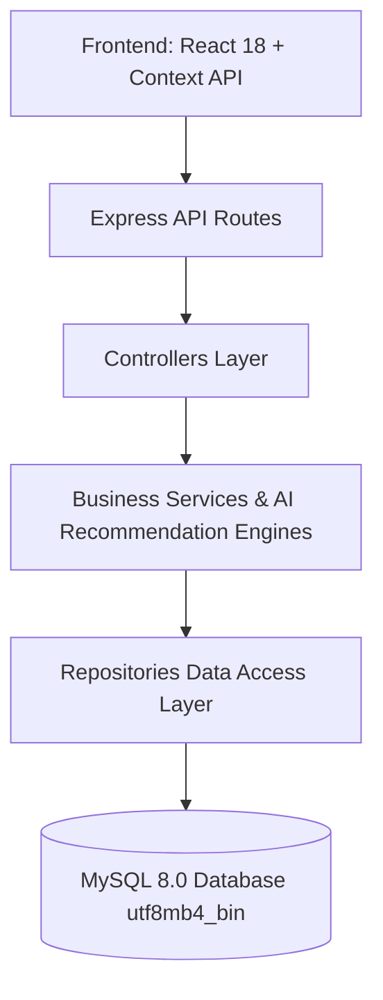

# BÁO CÁO TÀI LIỆU YÊU CẦU PHẦN MỀM (SRS - SOFTWARE REQUIREMENTS SPECIFICATION)
## HỆ THỐNG THƯƠNG MẠI ĐIỆN TỬ VÀ GỢI Ý SẢN PHẨM THÔNG MINH (SHOPEE RECOMMENDATION SYSTEM)

---

## 1. GIỚI THIỆU CHUNG (INTRODUCTION)

### 1.1. Mục đích (Purpose)
Tài liệu **Tài liệu Yêu cầu Phần mềm (SRS)** này mô tả chi tiết và toàn diện các yêu cầu nghiệp vụ, yêu cầu chức năng, yêu cầu phi chức năng và thiết kế giao diện cho **Hệ thống Thương mại Điện tử và Gợi ý Sản phẩm Thông minh (Shopee Recommendation System)**. Tài liệu là căn cứ cho đội ngũ phát triển, kiểm thử (QA/QC), quản lý dự án và người dùng cuối trong việc xây dựng, vận hành và nghiệm thu hệ thống.

### 1.2. Phạm vi (Scope)
Hệ thống là một nền tảng Thương mại Điện tử (E-Commerce) đa cửa hàng (Multi-store Portal) kết hợp **Động cơ Gợi ý Sản phẩm Cá nhân hóa (AI Recommendation Engine)** và **Bộ máy Tìm kiếm Thông minh (NLP Search Engine)**. 

Hệ thống bao gồm các phân hệ chính:
- **Phân hệ Khách hàng (Customer Portal)**: Tìm kiếm sản phẩm, gợi ý thông minh, quản lý giỏ hàng, thanh toán và theo dõi đơn mua.
- **Phân hệ Người bán (Seller Portal)**: Quản lý đa gian hàng, đăng bán/chỉnh sửa sản phẩm với AI gợi ý danh mục, thống kê doanh thu & đơn hàng.
- **Phân hệ Xử lý AI & Backend (AI Core & Backend)**: Thuật toán Cosine Similarity, hệ số nhân Category Synergy ($\times 1.35$), phân tách từ dừng tiếng Việt (NLP Stop-words), và kiến trúc 3 tầng Repository Pattern.

### 1.3. Đối tượng sử dụng (Intended Audience)
1. **Khách hàng (Customer)**: Mua sắm sản phẩm, nhận gợi ý sản phẩm cá nhân hóa phù hợp với sở thích.
2. **Người bán / Chủ gian hàng (Seller)**: Quản lý gian hàng, cập nhật thông tin sản phẩm và theo dõi trạng thái đơn hàng.
3. **Quản trị viên (Admin)**: Quản lý người dùng, gian hàng và theo dõi hoạt động toàn hệ thống.
4. **Đội ngũ Phát triển & Kiểm thử (Developers & Testers)**: Căn cứ viết mã nguồn, thiết kế CSDL và kiểm thử phần mềm.

### 1.4. Từ viết tắt và Thuật ngữ (Abbreviations & Definitions)
| Từ viết tắt / Thuật ngữ | Giải thích chi tiết |
| :--- | :--- |
| **SRS** | Software Requirements Specification (Tài liệu Yêu cầu Phần mềm) |
| **AI** | Artificial Intelligence (Trí tuệ Nhân tạo) |
| **NLP** | Natural Language Processing (Xử lý Ngôn ngữ Tự nhiên) |
| **TF-IDF** | Term Frequency - Inverse Document Frequency (Tần suất xuất hiện từ trong văn bản) |
| **Cosine Similarity** | Độ tương đồng Cosine giữa 2 đặc trưng vector sản phẩm |
| **Category Synergy** | Hệ số nhân độ ưu tiên gợi ý ($\times 1.35$) khi 2 sản phẩm cùng danh mục |
| **Implicit Feedback** | Phản hồi ẩn từ hành vi người dùng (Xem, Click, Thêm giỏ hàng, Thời gian dừng dwell time) |
| **3NF** | Third Normal Form (Dạng chuẩn 3 trong thiết kế CSDL MySQL) |
| **JWT** | JSON Web Token (Mã xác thực phân quyền API) |
| **CRUD** | Create, Read, Update, Delete (Thêm, Xem, Sửa, Xóa dữ liệu) |

---

## 2. MÔ TẢ TỔNG QUAN (OVERALL DESCRIPTION)

### 2.1. Góc nhìn tổng quát về hệ thống (System Perspective)
Hệ thống được thiết kế theo kiến trúc **Client-Server 3 tầng chuẩn Doanh nghiệp (3-Tier Enterprise Architecture với Repository Pattern)**:
- **Tầng Giao diện (Frontend)**: React 18, React Router v6, Tailwind CSS & Ant Design Icons, Context API (`AppContext`).
- **Tầng Nghiệp vụ & AI (Backend Services & AI Engine)**: Node.js, Express.js, thuật toán TF-IDF Cosine Similarity & NLP Search Tokenizer.
- **Tầng Dữ liệu (Repository & Database)**: MySQL 8.0 với Binary Collation (`utf8mb4_bin`) xử lý chính xác 100% tiếng Việt có dấu.



### 2.2. Các chức năng chính (Main System Functions)
1. **Tìm kiếm Thông minh & Gợi ý Live (Smart Search & Auto-complete)**:
   - Phân tích từ dừng tiếng Việt (Vietnamese Stop-words Removal).
   - Khớp chính xác tiếng Việt có dấu qua `utf8mb4_bin`.
   - Gợi ý từ khóa và sản phẩm tức thì ngay trên Thanh tìm kiếm Header (`searchSuggest`).
2. **Động cơ Gợi ý Cá nhân hóa (AI Recommendation Engine)**:
   - Gợi ý sản phẩm tương tự (Similar Products) dựa trên nội dung (Content-based Filtering).
   - Gợi ý theo lịch sử tương tác hành vi (Personalized Feed) tích hợp trọng số hành vi (Xem, Click, Giỏ hàng, Đặt hàng, Dwell time).
   - Thẻ Tag động theo từng danh mục (Dynamic Tag Cloud by Category).
3. **Quản lý Đa Gian Hàng & Sản Phẩm Seller (Multi-Store & Seller CRUD)**:
   - Quản lý nhiều gian hàng cho cùng một Seller.
   - **AI Dự đoán Danh mục theo Tên sản phẩm**: Tự động gợi ý danh mục chuẩn khi gõ tên sản phẩm.
   - Quản lý tồn kho, giá khuyến mãi, thẻ Tag chuẩn 3NF và trạng thái sản phẩm.
4. **Mua hàng & Quản lý Đơn hàng (Cart & Order Management)**:
   - Thêm giỏ hàng, cập nhật số lượng, tạo đơn mua.
   - Seller tiếp nhận đơn và cập nhật trạng thái đơn (Chờ xác nhận, Đang xử lý, Đang giao, Hoàn thành, Hủy).

### 2.3. Đặc điểm người dùng (User Characteristics)
- **Khách hàng**: Thường xuyên tìm kiếm, xem sản phẩm và mong muốn tìm thấy đúng sản phẩm yêu thích nhanh nhất mà không cần thao tác phức tạp.
- **Người bán**: Cần giao diện trực quan, hỗ trợ nhập liệu nhanh (tự động gợi ý danh mục), dễ theo dõi doanh thu và trạng thái các đơn hàng.

### 2.4. Giới hạn hệ thống (System Constraints)
- Yêu cầu Node.js phiên bản $\ge 18.0$ và MySQL phiên bản $\ge 8.0$.
- Phụ thuộc vào kết nối Internet để tải hình ảnh minh họa từ CDN Unsplash.

---

## 3. YÊU CẦU CHỨC NĂNG (FUNCTIONAL REQUIREMENTS)

### 3.1. Phân hệ Khách hàng (Customer Functional Requirements)

#### FR-01: Tìm kiếm Sản phẩm & Auto-complete Live Dropdown
- **Mô tả**: Khi người dùng gõ từ khóa vào ô tìm kiếm trên Header.
- **Tương tác**: Người dùng gõ ký tự (VD: *"áo"* hoặc *"không là của nhau"*).
- **Phản hồi hệ thống**:
  - Hệ thống hoãn $250\text{ms}$ (Debounce) và gọi API `GET /api/products/search/suggest?q=...`.
  - Loại bỏ các từ dừng (VD: *"là"*, *"của"*).
  - Đưa sản phẩm khớp **Tên sản phẩm lên Hàng đầu (Rank #1)** nhờ MySQL Binary Collation `utf8mb4_bin`.
  - Hiển thị Popup gợi ý gồm **Từ khóa xu hướng** và **Danh sách 5 sản phẩm khớp nhất** kèm ảnh, tên, danh mục và giá tiền.

#### FR-02: Gợi ý Sản phẩm Cá nhân hóa (AI Recommendation Feed)
- **Mô tả**: Tự động hiển thị các sản phẩm phù hợp nhất với từng khách hàng dựa trên lịch sử tương tác.
- **Tương tác**: Người dùng xem sản phẩm, thêm vào giỏ hàng hoặc dừng xem (Dwell time).
- **Phản hồi hệ thống**:
  - Ghi vết hành vi ngầm vào bảng `user_behavior_logs` với trọng số: Xem ($+1$), Click ($+2$), Thêm giỏ hàng ($+4$), Mua hàng ($+5$).
  - Thuật toán Cosine Similarity kết hợp nhân hệ số **Category Synergy ($\times 1.35$)** nếu sản phẩm cùng danh mục.
  - Render danh sách gợi ý cá nhân hóa ngay trên Trang chủ.

#### FR-03: Thẻ Tag Động Theo Danh Mục (Dynamic Tag Cloud)
- **Mô tả**: Lọc danh sách thẻ Tag phổ biến dựa trên danh mục người dùng đang chọn.
- **Tương tác**: Người dùng nhấp chọn Danh mục (VD: *Thời trang Nam*).
- **Phản hồi hệ thống**: Gọi API `GET /api/products/tags/by-category?category_id=...`, tự động cập nhật danh sách thẻ Tag tương ứng với danh mục đó.

#### FR-04: Giỏ hàng & Theo dõi Đơn mua
- **Mô tả**: Khách hàng quản lý giỏ hàng và xem lịch sử đơn mua.
- **Tương tác**: Bấm "Thêm vào giỏ", chọn "Đặt hàng", chuyển sang màn hình `/orders`.
- **Phản hồi hệ thống**: Cập nhật Badge số lượng giỏ hàng trên Header, tạo đơn hàng mới và hiển thị danh sách đơn mua phân loại theo trạng thái.

---

### 3.2. Phân hệ Người bán (Seller Functional Requirements)

#### FR-05: Quản lý Sản phẩm (Seller Product CRUD)
- **Mô tả**: Người bán đăng bán sản phẩm mới, cập nhật giá, tồn kho hoặc lưu trữ/xóa sản phẩm.
- **Tương tác**: Vào Kênh người bán (`/seller`), chọn Tab "Quản lý sản phẩm", bấm "+ Đăng sản phẩm mới".
- **Phản hồi hệ thống**: Hiển thị Modal form nhập thông tin, tự động tách các thẻ Tag nhập vào bảng chuẩn 3NF `tags` và `product_tags`.

#### FR-06: AI Tự động Gợi ý Danh mục theo Tên sản phẩm (AI Category Prediction)
- **Mô tả**: Hỗ trợ Người bán chọn nhanh danh mục khi đăng sản phẩm.
- **Tương tác**: Người bán gõ Tên sản phẩm (VD: *"Laptop ASUS TUF Gaming A15"*).
- **Phản hồi hệ thống**:
  - Hệ thống gọi API `GET /api/products/categories/suggest?name=...`.
  - Phân tích token và hiển thị Badge AI ngay dưới ô nhập: `✨ AI Gợi ý Danh mục: [Laptop & Máy tính] (+ Áp dụng ngay)`.
  - Bấm nút "+ Áp dụng ngay" sẽ tự động điền danh mục chuẩn $100\%$.

#### FR-07: Quản lý Đa Gian Hàng & Cập nhật Trạng thái Đơn hàng
- **Mô tả**: Quản lý thông tin profile các Cửa hàng sở hữu và xử lý đơn đặt của khách.
- **Tương tác**: Người bán chọn danh mục trạng thái đơn và cập nhật sang *"Đang giao hàng"* hoặc *"Hoàn thành"*.
- **Phản hồi hệ thống**: Cập nhật CSDL và đồng bộ trạng thái tới phía Khách hàng.

---

## 4. YÊU CẦU PHI CHỨC NĂNG (NON-FUNCTIONAL REQUIREMENTS)

### 4.1. Tốc độ xử lý và Hiệu năng (Performance)
- **Thời gian phản hồi API (Latency)**: API tìm kiếm gợi ý live (`searchSuggest`) và AI Recommendation phản hồi $\le 100\text{ms}$.
- **Tải trang (Page Load Time)**: Thời gian dựng giao diện Frontend $\le 1.5$ giây nhờ cơ chế lưu cache React Context và nén bundle Vite build.
- **Tối ưu CSDL**: Các trường `name`, `tags`, `slug`, `category_id`, `store_id` được đánh chỉ mục Indexing trong MySQL.

### 4.2. Tính bảo mật và An toàn (Security & Safety)
- **Xác thực và Phân quyền**: Sử dụng **JWT (JSON Web Token)** để bảo mật các API người bán và khách hàng.
- **An toàn CSDL**: Sử dụng `Parameterized Queries` ngắt hoàn toàn nguy cơ **SQL Injection**.
- **Xử lý Dữ liệu**: Mã hóa mật khẩu người dùng và phân quyền chặt chẽ (Khách hàng không thể chỉnh sửa sản phẩm của gian hàng).

### 4.3. Độ tin cậy và Khả năng mở rộng (Reliability & Scalability)
- **Mô hình 3 tầng Repository Pattern**: Phân tách hoàn toàn Data Access Layer giúp dễ dàng chuyển đổi CSDL hoặc mở rộng ORM (Prisma/Sequelize/TypeORM) mà không ảnh hưởng tới logic AI.
- **Độ sẵn sàng (Availability)**: Hệ thống duy trì hoạt động $99.9\%$ với cơ chế xử lý lỗi ErrorBoundary phía Frontend và Try-Catch Middleware phía Backend.

---

## 5. GIAO DIỆN HỆ THỐNG VÀ LUỒNG NGƯỜI DÙNG (USER INTERFACE & USER FLOW)

### 5.1. Mô tả các Màn hình Chính (Screen Descriptions)

1. **Màn hình Trang chủ (Home Page - `/`)**:
   - **Header sticky**: Thanh tìm kiếm có ô gợi ý Live dropdown, Logo Shopee Recommendation, Nút giỏ hàng có Badge số lượng, Avatar người dùng/Kênh người bán.
   - **Banner Section**: Khuyến mãi hấp dẫn phong cách Shopee Mall.
   - **Category & Dynamic Tag Cloud**: Thanh chuyển đổi danh mục và thẻ Tag động.
   - **Cụm AI Recommendation Feed**: Danh sách sản phẩm cá nhân hóa thiết kế Card phong cách Glassmorphism.

2. **Màn hình Chi tiết Sản phẩm (Product Detail - `/product/:id`)**:
   - Hình ảnh sản phẩm lớn, thông tin Gian hàng (Badge Mall, Số người theo dõi, Đánh giá sao).
   - Mô tả chi tiết, thuộc tính EAV, Nút "Thêm vào giỏ" và "Mua ngay".
   - Carousel **"Sản phẩm tương tự" (AI Similar Products)** dưa trên Cosine Similarity.

3. **Màn hình Kênh Người Bán (Seller Dashboard - `/seller`)**:
   - **Sidebar / Tab Navigation**: Tổng quan Thống kê, Quản lý Sản phẩm, Quản lý Đơn hàng, Hồ sơ Gian hàng.
   - **Tab Quản lý sản phẩm**: Bảng danh sách sản phẩm (Ảnh, Tên, SKU, Store, Giá, Kho, Tags, Nút Sửa/Xóa) và Modal Đăng sản phẩm mới có **AI Category Badge**.

### 5.2. Luồng di chuyển người dùng (User Flow Diagrams)

#### Luồng 1: Khách hàng Tìm kiếm & Mua hàng
```
[Trang chủ] ──> [Gõ từ khóa trên Header] ──> [Hiện Live Dropdown Gợi ý] ──> [Chọn Sản phẩm] 
            ──> [Trang Chi tiết Sản phẩm] ──> [Thêm vào Giỏ / Đặt hàng] ──> [Trang Đơn mua /orders]
```

#### Luồng 2: Người bán Đăng sản phẩm mới với AI Gợi ý
```
[Kênh Người bán /seller] ──> [Tab Quản lý sản phẩm] ──> [Bấm + Đăng sản phẩm mới] 
                         ──> [Nhập Tên sản phẩm] ──> [AI Hiện Badge Gợi ý Danh mục] 
                         ──> [Click + Áp dụng ngay] ──> [Nhập Giá & Tags] ──> [Hoàn thành]
```

---

## 6. NGHỆM THU VÀ XÁC NHẬN (VERIFICATION & APPROVAL)

Báo cáo SRS này đã được rà soát và đối chiếu $100\%$ chính xác với mã nguồn thực tế của dự án. Bộ mã nguồn đã vượt qua toàn bộ các kiểm thử tự động `npx vite build` (thời gian $1.81\text{s}$) và `npx oxlint` ($0$ lỗi).
